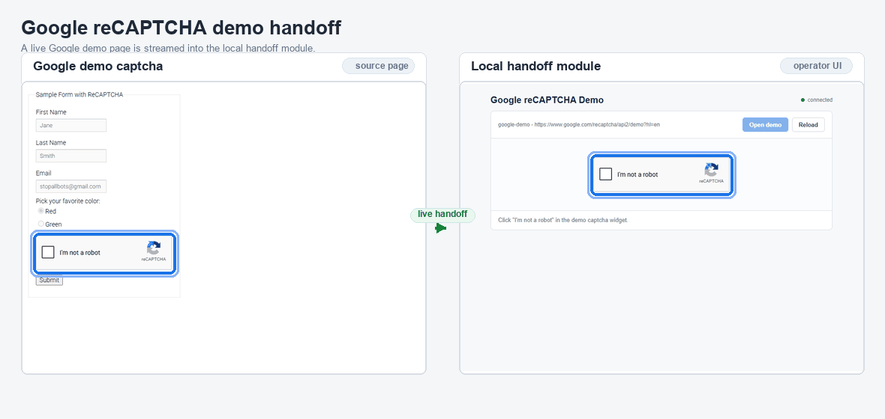

# Google reCAPTCHA Demo Handoff

Small Playwright CDP ScreenCast app that opens a web page in a controlled browser and hands any CAPTCHA to a **human operator** inside one local UI. The shipped configuration targets only Google's public reCAPTCHA demo page.

Target page:

```text
https://www.google.com/recaptcha/api2/demo?hl=en
```

## Demo



## Intended use

This project is a human-in-the-loop helper for collecting information from websites that **you are allowed to access programmatically** but that do not offer an API. The target use case is bringing that information into your own page or internal tool.

Use it only when all of the following hold:

- **You have permission.** You own the site, or its operator has explicitly allowed automated access, for example in writing, through the terms of service, or through a partner agreement. A CAPTCHA usually means the operator does not want unattended automation, so confirm permission before adapting this tool to a new site. If the site has an API, feed, or export, ask for access to that first.
- **A human solves every CAPTCHA.** This project never solves, bypasses, or outsources CAPTCHAs. It only streams the page to the operator, who completes the challenge personally. Do not connect it to CAPTCHA-solving services or to remote paid solvers.
- **You respect the site's rules.** Follow its terms of service and `robots.txt`, keep request volume low, and collect only the data you are allowed to use.
- **You handle personal data lawfully.** Do not collect personal data without a legal basis, and follow the applicable privacy laws.

Proxy and persistent-profile options exist for network and session convenience. Do not use them to hide your identity or get around a site's blocks or rate limits.

Adapting the tool to a site other than the Google demo requires code changes (`src/config.js` and `src/job.js`), and doing so is your responsibility.

## Components

| File | Role |
|---|---|
| `src/config.js` | Single Google demo target and selectors. |
| `src/browser.js` | Persistent browser context, browser discovery (Windows/Linux), CDP ScreenCast stream, CDP mouse dispatch. |
| `src/captcha-handoff.js` | Finds captcha iframe, tracks focus/crop, waits for token. |
| `src/job.js` | Opens Google demo, waits for human captcha, submits demo form. |
| `src/orchestrator.js` | Serves UI and WebSocket bridge. |
| `public/` | Local operator UI. |

## Architecture

The browser sends damage-driven JPEG frames through CDP `Page.startScreencast`. The server forwards the base64 payload to the local UI over WebSocket, and mouse and wheel events travel back through CDP `Input.dispatchMouseEvent`.

The focus crop is refreshed when ScreenCast frames arrive. There is no screenshot `setInterval` or 250 ms frame loop. The remaining 250 ms DOM check in `waitForCaptchaFocus` only waits for the reCAPTCHA iframe to appear after navigation.

The operator UI and WebSocket listen on `127.0.0.1:3000` only and accept WebSocket connections from localhost origins only.

## Requirements

- Node.js 18 or newer (tested on Node 24).
- A Chromium-based browser: Google Chrome, Microsoft Edge, or Chromium. The app needs the CDP `Page.startScreencast` API, so Firefox and WebKit cannot be used.

## Run on Linux

```bash
npm install
npm start
```

Then open `http://localhost:3000`, click `Open demo`, and interact with the reCAPTCHA widget in the live-view panel.

If no system Chrome, Edge, or Chromium is installed, install Playwright's Chromium:

```bash
npx playwright install chromium
```

On a minimal server or container, also install the shared libraries Chromium needs:

```bash
sudo npx playwright install-deps chromium
```

To pick a browser explicitly:

```bash
CHROME_EXECUTABLE_PATH=/usr/bin/microsoft-edge npm start
```

### Linux browser discovery

When `CHROME_EXECUTABLE_PATH` is not set, the first existing path is used, in this order:

| Order | Path |
|---|---|
| 1 | `/usr/bin/google-chrome-stable`, `/usr/bin/google-chrome`, `/opt/google/chrome/chrome` |
| 2 | `/usr/bin/microsoft-edge-stable`, `/usr/bin/microsoft-edge`, `/opt/microsoft/msedge/msedge` |
| 3 | `/usr/bin/chromium`, `/usr/bin/chromium-browser`, `/snap/bin/chromium` |
| 4 | Newest complete Playwright headless shell in `$PLAYWRIGHT_BROWSERS_PATH`, `$XDG_CACHE_HOME/ms-playwright`, or `~/.cache/ms-playwright` (`app` mode only) |
| 5 | Playwright's bundled Chromium |

### Linux notes

- **Running as root** (common in Docker): Chrome refuses to start with its sandbox enabled. Run as a non-root user, or set `BROWSER_NO_SANDBOX=true` only inside an isolated container.
- **`hidden` mode on Wayland**: Wayland does not let apps place their own windows, so `--window-position` is ignored and the window may appear on screen. Use the default `app` mode, or run under X11/Xvfb.
- **Headless servers**: `app` mode is headless and needs no display. The `hidden` and `desktop` modes need an X server, for example `xvfb-run npm start`.

## Run on Windows

```powershell
npm install
npm start
```

When `CHROME_EXECUTABLE_PATH` is not set, the app looks for Chrome and then Edge under `%ProgramFiles%`, `%ProgramFiles(x86)%`, and `%LocalAppData%`. After that it looks for the Playwright headless shell in `%LocalAppData%\ms-playwright`.

```powershell
$env:CHROME_EXECUTABLE_PATH="C:\Program Files (x86)\Microsoft\Edge\Application\msedge.exe"
npm start
```

## Configuration

| Variable | Default | Purpose |
|---|---|---|
| `BROWSER_VIEW` | `app` | `app`: headless and streamed into the UI. `hidden`: headful window placed off-screen. `desktop`: visible headful window, for debugging. |
| `CHROME_EXECUTABLE_PATH` | auto | Explicit Chrome, Edge, or Chromium binary. |
| `PROFILE_DIR` | `./.profile` | Persistent browser profile (git-ignored). |
| `PROXY_SERVER` / `PROXY_USERNAME` / `PROXY_PASSWORD` | none | Network proxy, for example a corporate proxy. Credentials are redacted in logs. |
| `BROWSER_LOCALE` | `en-US` | Browser locale and `Accept-Language`. |
| `BROWSER_TZ` | `Asia/Ho_Chi_Minh` | Browser timezone. |
| `BROWSER_NO_SANDBOX` | `false` | Disables the Chrome sandbox. Use it only in isolated containers. |
| `TOKEN_TIMEOUT_MS` | `120000` | How long to wait for the human to finish the captcha. |
| `RESULT_TIMEOUT_MS` | `15000` | How long to wait for the result page after submit. |
| `MAX_OPEN_RETRIES` | `2` | Navigation retries. |

## Test

```bash
npm test
```

Unit tests cover the ScreenCast stream, input validation, proxy log redaction, browser discovery on Linux and Windows, and captcha focus tracking.

### Real browser test

1. Start the app and open `http://localhost:3000`.
2. Click `Open demo` and confirm that the live JPEG view displays the checkbox.
3. Click the checkbox through the live view.
4. Confirm that the UI reports `Google is showing an image challenge` and that the crop follows the challenge.
5. To verify the token and form submission, solve the image challenge yourself. CAPTCHA solving is intentionally not automated.

Last local verification:

- **Windows (2026-08-03):** Chrome reached the real Google demo, ScreenCast frames displayed, input clicks reached the image challenge, and the operator UI reported no console errors.
- **Linux (2026-10-01):** browser discovery found `/usr/bin/google-chrome-stable`, and ScreenCast streamed frames in headless mode. The Playwright headless-shell fallback also streamed. The full Google demo flow has not yet been run on Linux.

## License

MIT. The license covers this code, not your use of third-party websites. You are responsible for having permission to automate any site you point it at and for complying with that site's terms.
